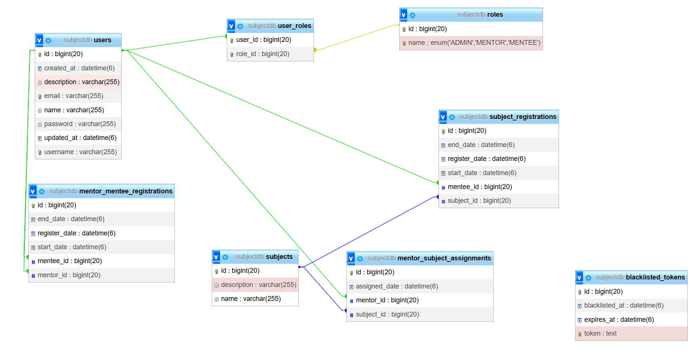

# 📘 Hướng dẫn sử dụng hệ thống

[//]: # (insert dữ liệu ban đầu)

---
domain mua trên porkbun chạy trên EC2: https://sakira.space/ </br>
https://hub.docker.com/repositories/fivontwov

## 🗄️ Database

<details>
<summary>Truy cập và kiểm tra dữ liệu</summary>

docker exec -it study_management_db bash  
psql -U postgres -d subjectdb  
\dt  
SELECT tablename FROM pg_tables WHERE schemaname = 'public';  
SELECT * FROM users LIMIT 10;
user1 admin,mentor
user2 mentee
</details>

---

## 🔐 Authentication

<details>
<summary>Login</summary>

[POST] /auth/login  
```bash
{  
    "username": "user1",  
    "password": "123456"  
}
```
</details>

<details>
<summary>Logout</summary>

[POST] /auth/logout

</details>

---

## 👤 User Management

<details>
<summary>Add a new user</summary>

[POST] /users  
<pre>
{
	"username": "nguyen.van.a",
	"password": "matkhauquayeu12$A",
    "description": "Experienced Engineer",
	"name": "Nguyen Van A",
	"email": "gigi@gmail.com",
	"role": "MENTOR"
}
</pre>
</details>

<details>
<summary>Update user info</summary>

[PUT] /users/{userId}  
{ "name": "Nguyen Van B", "description": "New employee", "email": "<a href='https://confluence-mx.sec.samsung.net/plugins/servlet/pii4conf/pii?id=193846'>●●●●●●●●●●●●●●●●●●●●●●●●</a>" }

</details>

<details>
<summary>Delete a user</summary>

[DELETE] /users/{userId}

</details>

<details>
<summary>View user list</summary>

[GET] /users

| Param  | Type   | Optional | Description |
|--------|--------|----------|-------------|
| search | String | Yes      | Từ khóa tìm kiếm |
| page   | Long   | Yes      | >= 0 (default: 0) |
| size   | Long   | Yes      | > 0 (default: 10) |
| sort   | String | Yes      | asc hoặc desc |
| name   | String | Yes      | [a-z] – Tên cột cần sắp xếp |

</details>

<details>
<summary>View user details</summary>

[GET] /users/{userId}

</details>

<details>
<summary>Get mentor list</summary>

[GET] /users/mentors  
**(Same params như /users)**

</details>

---

## 📚 Subject Management

<details>
<summary>Add subject</summary>

[POST] /subjects  
{ "name": "UML", "description": "design system using UML", "mentorIds": [1,2] }

</details>

<details>
<summary>Update subject</summary>

[PUT] /subjects/{subjectId}  
{ "name": "UML", "description": "design system using UML", "mentorIds": [3,4] }

</details>

<details>
<summary>Delete subject</summary>

[DELETE] /subjects/{subjectId}

</details>

<details>
<summary>View subjects</summary>

[GET] /subjects

</details>

<details>
<summary>View subjects for mentor</summary>

[GET] /subjects-assigned  
**(Same params như /users)**

</details>

<details>
<summary>View subjects for mentee</summary>

[GET] /subjects/unregistered  
**(Same params như /users)**

[//]: # (chưa dùng được)
</details>

---

## 📝 Subject Registration

<details>
<summary>Create subject registration</summary>

[POST] /subject-registrations  
{ "subjectId": 1, "startDate": "2025-09-26T10:00:00", "endDate": "2025-12-25T10:00:00" }

</details>

<details>
<summary>View registrations by admin</summary>

[GET] /subject-registrations/admin  
**(Same params như /users)**

</details>

<details>
<summary>View registrations by mentee</summary>

[GET] /subject-registrations/mentee  
**(Same params như /users)**

</details>

---

## 🤝 Mentor–Mentee Registration

<details>
<summary>Create mentor–mentee registration</summary>

[POST] /mentor-mentee-registrations  
{ "mentorId": 1, "startDate": "2025-09-26T10:00:00", "endDate": "2025-12-25T10:00:00" }

</details>

<details>
<summary>View registrations by admin</summary>

[GET] /mentor-mentee-registrations/admin  
**(Same params như /users)**

</details>

<details>
<summary>View mentees by mentor</summary>

[GET] /mentor-mentee-registrations/mentor  
**(Same params như /users)**

</details>

<details>
<summary>View mentors by mentee</summary>

[GET] /mentor-mentee-registrations/mentee  
**(Same params như /users)**

</details>
  
index cho search full text search 2 bên %: 
trigram và GIN (tìm từ 1 phần hợp thành -> các hàng chứa thành phần đó) nhưng
nếu record ít thì postgre auto chọn seq thay vì index.
Cần đâu đấy 800 record để postgre bắt đầu chọn index
-> tắt seq là được index nào không nhanh thì xóa đi

#### Query for index
SET enable_seqscan = Off;

EXPLAIN ANALYZE
SELECT * FROM subjects s
WHERE LOWER(s.name) LIKE LOWER('%nghệ%');  
CREATE EXTENSION IF NOT EXISTS pg_trgm;  
CREATE INDEX idx_subject_name_lower_trgm
ON subjects USING GIN (LOWER(name) gin_trgm_ops);

CREATE INDEX idx_subject_description_trgm
ON subjects USING GIN (LOWER(description) gin_trgm_ops);

EXPLAIN ANALYZE
SELECT * FROM subjects
WHERE LOWER(description) LIKE LOWER('%math%');

<br>
fail phụ thuộc resourse nên chạy localhost, 2800 bắt đầu fail vì trả muộn. sakira thì 4000
nhận request 1 đống rồi trả về 1 đống nên rps bị lúc không lúc rất nhiều

## redis
docker exec -it redis redis-cli (để chạy local với image redis chạy)

## docker
docker login


docker tag ssstudy_management-app:latest fivontwov/ssstudy_management-app:latest  
docker push fivontwov/ssstudy_management-app:latest

Khi ở ec2:  
docker pull fivontwov/ssstudy_management-app:latest  
docker run -p 8080:8080 fivontwov/ssstudy_management-app:latest
docker images  
docker run -p 8080:8080 fivontwov/ssstudy_management-app:latest